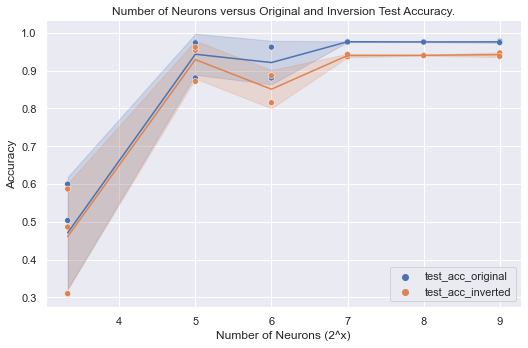
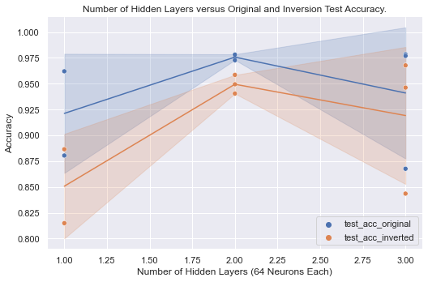
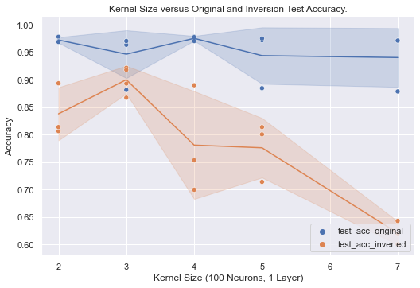
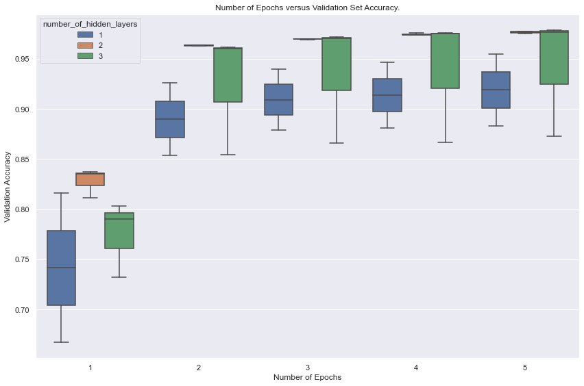

# <center> Data Analysis for OOCS-CNN Results </center>

## Meta
Date: April 23, 2022.  
Author: Parmandeep Chaddha.  
Course: SYDE 552 / BIOL 487.  
Instructor: Dr. Terry Stewart, Dr. Michael Furlong.  


```python
import pandas as pd
import numpy as np
import json
import glob
import matplotlib.pyplot as plt
import seaborn as sns
from pathlib import Path
from math import log

sns.set_style('darkgrid')
```


```python
## Validation data.
df = pd.DataFrame(
    columns=['test_number', 'inv_accuracy', 'accuracy'],
    data = [
        [1, 82.2, 96.1],
        [2, 91.4, 97.6],
        [3, 92.4, 95.0]
    ]
)
df.describe()
```


<div>
<style scoped>
    .dataframe tbody tr th:only-of-type {
        vertical-align: middle;
    }

    .dataframe tbody tr th {
        vertical-align: top;
    }

    .dataframe thead th {
        text-align: right;
    }
</style>
<table border="1" class="dataframe">
  <thead>
    <tr style="text-align: right;">
      <th></th>
      <th>test_number</th>
      <th>inv_accuracy</th>
      <th>accuracy</th>
    </tr>
  </thead>
  <tbody>
    <tr>
      <th>count</th>
      <td>3.0</td>
      <td>3.000000</td>
      <td>3.000000</td>
    </tr>
    <tr>
      <th>mean</th>
      <td>2.0</td>
      <td>88.666667</td>
      <td>96.233333</td>
    </tr>
    <tr>
      <th>std</th>
      <td>1.0</td>
      <td>5.622574</td>
      <td>1.305118</td>
    </tr>
    <tr>
      <th>min</th>
      <td>1.0</td>
      <td>82.200000</td>
      <td>95.000000</td>
    </tr>
    <tr>
      <th>25%</th>
      <td>1.5</td>
      <td>86.800000</td>
      <td>95.550000</td>
    </tr>
    <tr>
      <th>50%</th>
      <td>2.0</td>
      <td>91.400000</td>
      <td>96.100000</td>
    </tr>
    <tr>
      <th>75%</th>
      <td>2.5</td>
      <td>91.900000</td>
      <td>96.850000</td>
    </tr>
    <tr>
      <th>max</th>
      <td>3.0</td>
      <td>92.400000</td>
      <td>97.600000</td>
    </tr>
  </tbody>
</table>
</div>


```python
def extract_parameter(stemname, parameter_name='_n', default_value=None):
    this_neuron = [i for i in stemname if parameter_name in i]
    if this_neuron and this_neuron != ' ':
        return int(this_neuron[-1][1:])
    else:
        return default_value
    

def get_file_data(filename, sub='test'):
    df1 = pd.read_json(filename)

    if sub == 'test':
        df1 = df1[
            ['test_acc_original', 'test_loss_original', 'test_acc_inverted', 'test_loss_inverted']
        ]
    elif sub == 'epoch':
        df1 = df1[['val_accs', 'accs', 'losses', 'val_losses']]


    df1['filename'] = filename
    df1 = df1.reset_index().rename(columns={'index': 'epoch_number'})
    
    return df1

def parse_results(filename="neurons", sub='test'):
    all_files = glob.glob(f"./results/{filename}*")
    
    stems = [Path(i).stem.split("_")[1:] for i in all_files]
    
    parsed_data= []
    for file_i, this_file_name in enumerate(all_files):
        this_dict = {}
        this_dict['filename'] = this_file_name
        this_dict['neuron'] = extract_parameter(stems[file_i], 'n', None)
        this_dict['trial_number'] = extract_parameter(stems[file_i], 't', 1)
        this_dict['layer'] = extract_parameter(stems[file_i], 'l', None)
        this_dict['kernel_size'] =\
            extract_parameter(stems[file_i], 'k', 1)        
        if sub == 'test':
            this_data = dict(get_file_data(this_file_name, sub=sub).iloc[-1])
            this_dict = {**this_dict, **this_data}
            parsed_data.append(this_dict)

        if sub == 'epoch':
            this_data = get_file_data(this_file_name, sub=sub).to_dict(orient="records")
            this_data = [{**i, **this_dict} for i in this_data]
            parsed_data = parsed_data + this_data
        
    df = pd.DataFrame(parsed_data)
    return df
```


```python
def melt_accuracy(df):
    value_vars = ['test_acc_original', 'test_acc_inverted']
    id_vars = [i for i in df.columns if i not in value_vars]
    df = pd.melt(
        df, id_vars=id_vars, value_vars=value_vars,
        var_name='acc_type', value_name='accuracy'
    )
    return df
```

## Number of Neurons Results


```python
neuron_data = parse_results()
neuron_data_epoch = parse_results(filename='neuron', sub='epoch')
```


```python
neurons_melt = melt_accuracy(neuron_data)
neurons_melt['neuron'] = neurons_melt['neuron'].apply(lambda x: log(x,2))

sns.set(rc={'figure.figsize':(12,8)})
fig1 = sns.relplot(
    data=neurons_melt,
    x='neuron',
    y='accuracy',
    hue='acc_type',
    kind='line',
    ci="sd",
    aspect=1.5,
    legend=False,
).set(
    xlabel='Number of Neurons (2^x)',
    ylabel='Accuracy',
    title="Number of Neurons versus Original and Inversion Test Accuracy."
)
sns.scatterplot(data=neurons_melt, x='neuron', y='accuracy', hue='acc_type')
plt.legend(loc='lower right')
plt.tight_layout()
plt.savefig('analysis/neurons.png', dpi=400)
neuron_data.to_csv('analysis/neuron_data.csv', index=False)
plt.show()
```


    

    


## Number of Layers


```python
# The control data for this experiment is in the `neurons data` dataframe.
layer_data = parse_results(filename='_l')
control_data = neuron_data[neuron_data.neuron == 64].copy()
control_data['layer'] = 1
layer_data = pd.concat([layer_data, control_data], ignore_index=True)
layer_data
```


<div>
<style scoped>
    .dataframe tbody tr th:only-of-type {
        vertical-align: middle;
    }

    .dataframe tbody tr th {
        vertical-align: top;
    }

    .dataframe thead th {
        text-align: right;
    }
</style>
<table border="1" class="dataframe">
  <thead>
    <tr style="text-align: right;">
      <th></th>
      <th>filename</th>
      <th>neuron</th>
      <th>trial_number</th>
      <th>layer</th>
      <th>kernel_size</th>
      <th>epoch_number</th>
      <th>test_acc_original</th>
      <th>test_loss_original</th>
      <th>test_acc_inverted</th>
      <th>test_loss_inverted</th>
    </tr>
  </thead>
  <tbody>
    <tr>
      <th>0</th>
      <td>./results/_l_l3_n64_t3.json</td>
      <td>64</td>
      <td>3</td>
      <td>3</td>
      <td>1</td>
      <td>4</td>
      <td>0.9784</td>
      <td>3.213843</td>
      <td>0.9677</td>
      <td>3.225535</td>
    </tr>
    <tr>
      <th>1</th>
      <td>./results/_l_l3_n64_t2.json</td>
      <td>64</td>
      <td>2</td>
      <td>3</td>
      <td>1</td>
      <td>4</td>
      <td>0.8676</td>
      <td>3.320639</td>
      <td>0.8435</td>
      <td>3.349528</td>
    </tr>
    <tr>
      <th>2</th>
      <td>./results/_l_l2_n64_t1.json</td>
      <td>64</td>
      <td>1</td>
      <td>2</td>
      <td>1</td>
      <td>4</td>
      <td>0.9763</td>
      <td>3.215637</td>
      <td>0.9585</td>
      <td>3.237355</td>
    </tr>
    <tr>
      <th>3</th>
      <td>./results/_l_l2_n64_t2.json</td>
      <td>64</td>
      <td>2</td>
      <td>2</td>
      <td>1</td>
      <td>4</td>
      <td>0.9781</td>
      <td>3.213967</td>
      <td>0.9404</td>
      <td>3.254774</td>
    </tr>
    <tr>
      <th>4</th>
      <td>./results/_l_l2_n64_t3.json</td>
      <td>64</td>
      <td>3</td>
      <td>2</td>
      <td>1</td>
      <td>4</td>
      <td>0.9727</td>
      <td>3.220904</td>
      <td>0.9494</td>
      <td>3.249990</td>
    </tr>
    <tr>
      <th>5</th>
      <td>./results/_l_l3_n64_t1.json</td>
      <td>64</td>
      <td>1</td>
      <td>3</td>
      <td>1</td>
      <td>4</td>
      <td>0.9769</td>
      <td>3.216650</td>
      <td>0.9462</td>
      <td>3.250271</td>
    </tr>
    <tr>
      <th>6</th>
      <td>./results/neurons_n64.json</td>
      <td>64</td>
      <td>1</td>
      <td>1</td>
      <td>1</td>
      <td>4</td>
      <td>0.9620</td>
      <td>3.313565</td>
      <td>0.8865</td>
      <td>3.339543</td>
    </tr>
    <tr>
      <th>7</th>
      <td>./results/neurons_n64_t2.json</td>
      <td>64</td>
      <td>2</td>
      <td>1</td>
      <td>1</td>
      <td>4</td>
      <td>0.8804</td>
      <td>3.311816</td>
      <td>0.8149</td>
      <td>3.386085</td>
    </tr>
  </tbody>
</table>
</div>


```python
layers_melt = melt_accuracy(layer_data)

sns.set(rc={'figure.figsize':(12,8)})
x_val = 'layer'
fig1 = sns.relplot(
    data=layers_melt,
    x=x_val,
    y='accuracy',
    hue='acc_type',
    kind='line',
    ci="sd",
    aspect=1.5,
    legend=False,
).set(
    xlabel='Number of Hidden Layers (64 Neurons Each)',
    ylabel='Accuracy',
    title="Number of Hidden Layers versus Original and Inversion Test Accuracy."
)
sns.scatterplot(data=layers_melt, x=x_val, y='accuracy', hue='acc_type')
plt.legend(loc='lower right')

plt.tight_layout()
plt.savefig('analysis/layers.png', dpi=400)
layer_data.to_csv('analysis/layer_data.csv', index=False)
plt.show()
```


    

    


## Kernel Size


```python
kernel_data = parse_results(filename='_kernel_size')
kernel_data.to_csv('analysis/kernel_data.csv', index=False)
kernel_data.head()
```


<div>
<style scoped>
    .dataframe tbody tr th:only-of-type {
        vertical-align: middle;
    }

    .dataframe tbody tr th {
        vertical-align: top;
    }

    .dataframe thead th {
        text-align: right;
    }
</style>
<table border="1" class="dataframe">
  <thead>
    <tr style="text-align: right;">
      <th></th>
      <th>filename</th>
      <th>neuron</th>
      <th>trial_number</th>
      <th>layer</th>
      <th>kernel_size</th>
      <th>epoch_number</th>
      <th>test_acc_original</th>
      <th>test_loss_original</th>
      <th>test_acc_inverted</th>
      <th>test_loss_inverted</th>
    </tr>
  </thead>
  <tbody>
    <tr>
      <th>0</th>
      <td>./results/_kernel_size_k2_l1_n100_t3.json</td>
      <td>100</td>
      <td>3</td>
      <td>1</td>
      <td>2</td>
      <td>2</td>
      <td>0.9783</td>
      <td>3.657374</td>
      <td>0.8065</td>
      <td>3.834151</td>
    </tr>
    <tr>
      <th>1</th>
      <td>./results/_kernel_size_k5_l1_n100_t2.json</td>
      <td>100</td>
      <td>2</td>
      <td>1</td>
      <td>5</td>
      <td>2</td>
      <td>0.8847</td>
      <td>3.750384</td>
      <td>0.7141</td>
      <td>3.928888</td>
    </tr>
    <tr>
      <th>2</th>
      <td>./results/_kernel_size_k3_l1_n100_t4.json</td>
      <td>100</td>
      <td>4</td>
      <td>1</td>
      <td>3</td>
      <td>2</td>
      <td>0.9637</td>
      <td>3.672904</td>
      <td>0.9219</td>
      <td>3.717668</td>
    </tr>
    <tr>
      <th>3</th>
      <td>./results/_kernel_size_k2_l1_n100_t2.json</td>
      <td>100</td>
      <td>2</td>
      <td>1</td>
      <td>2</td>
      <td>2</td>
      <td>0.9702</td>
      <td>3.664682</td>
      <td>0.8138</td>
      <td>3.824101</td>
    </tr>
    <tr>
      <th>4</th>
      <td>./results/_kernel_size_k5_l1_n100_t3.json</td>
      <td>100</td>
      <td>3</td>
      <td>1</td>
      <td>5</td>
      <td>2</td>
      <td>0.9721</td>
      <td>3.661507</td>
      <td>0.8138</td>
      <td>3.830383</td>
    </tr>
  </tbody>
</table>
</div>


```python
kernel_melt = melt_accuracy(kernel_data)

sns.set(rc={'figure.figsize':(12,8)})
x_val = 'kernel_size'
fig1 = sns.relplot(
    data=kernel_melt,
    x=x_val,
    y='accuracy',
    hue='acc_type',
    kind='line',
    ci="sd",
    aspect=1.5,
    legend=False,
).set(
    xlabel='Kernel Size (100 Neurons, 1 Layer)',
    ylabel='Accuracy',
    title="Kernel Size versus Original and Inversion Test Accuracy."
)
sns.scatterplot(data=kernel_melt, x=x_val, y='accuracy', hue='acc_type')
plt.legend(loc='lower right')
plt.savefig('analysis/kernels.png', dpi=400)
plt.show()
```


    

    


## Hidden Layer - Epochs v. Accuracy


```python
layer_data_epoch = parse_results(filename='_l', sub='epoch')\
    .rename(columns={'layer': 'number_of_hidden_layers'})

control_data = neuron_data_epoch[neuron_data_epoch.neuron == 64].copy()
control_data['number_of_hidden_layers'] = 1
layer_data_epoch = pd.concat([layer_data_epoch, control_data], ignore_index=True)\
    .sort_values(by='number_of_hidden_layers')

layer_data_epoch['epoch_number'] += 1
display(layer_data_epoch)
```


<div>
<style scoped>
    .dataframe tbody tr th:only-of-type {
        vertical-align: middle;
    }

    .dataframe tbody tr th {
        vertical-align: top;
    }

    .dataframe thead th {
        text-align: right;
    }
</style>
<table border="1" class="dataframe">
  <thead>
    <tr style="text-align: right;">
      <th></th>
      <th>epoch_number</th>
      <th>val_accs</th>
      <th>accs</th>
      <th>losses</th>
      <th>val_losses</th>
      <th>filename</th>
      <th>neuron</th>
      <th>trial_number</th>
      <th>number_of_hidden_layers</th>
      <th>kernel_size</th>
      <th>layer</th>
    </tr>
  </thead>
  <tbody>
    <tr>
      <th>39</th>
      <td>5</td>
      <td>0.882854</td>
      <td>0.889021</td>
      <td>3.307786</td>
      <td>3.311598</td>
      <td>./results/neurons_n64_t2.json</td>
      <td>64</td>
      <td>2</td>
      <td>1</td>
      <td>1</td>
      <td>None</td>
    </tr>
    <tr>
      <th>38</th>
      <td>4</td>
      <td>0.881042</td>
      <td>0.886208</td>
      <td>3.312582</td>
      <td>3.315960</td>
      <td>./results/neurons_n64_t2.json</td>
      <td>64</td>
      <td>2</td>
      <td>1</td>
      <td>1</td>
      <td>None</td>
    </tr>
    <tr>
      <th>31</th>
      <td>2</td>
      <td>0.925729</td>
      <td>0.939646</td>
      <td>3.327472</td>
      <td>3.337505</td>
      <td>./results/neurons_n64.json</td>
      <td>64</td>
      <td>1</td>
      <td>1</td>
      <td>1</td>
      <td>None</td>
    </tr>
    <tr>
      <th>32</th>
      <td>3</td>
      <td>0.939729</td>
      <td>0.954646</td>
      <td>3.315861</td>
      <td>3.323240</td>
      <td>./results/neurons_n64.json</td>
      <td>64</td>
      <td>1</td>
      <td>1</td>
      <td>1</td>
      <td>None</td>
    </tr>
    <tr>
      <th>33</th>
      <td>4</td>
      <td>0.946729</td>
      <td>0.962708</td>
      <td>3.309348</td>
      <td>3.323879</td>
      <td>./results/neurons_n64.json</td>
      <td>64</td>
      <td>1</td>
      <td>1</td>
      <td>1</td>
      <td>None</td>
    </tr>
    <tr>
      <th>30</th>
      <td>1</td>
      <td>0.816146</td>
      <td>0.833354</td>
      <td>3.441402</td>
      <td>3.451674</td>
      <td>./results/neurons_n64.json</td>
      <td>64</td>
      <td>1</td>
      <td>1</td>
      <td>1</td>
      <td>None</td>
    </tr>
    <tr>
      <th>35</th>
      <td>1</td>
      <td>0.667000</td>
      <td>0.669458</td>
      <td>3.575014</td>
      <td>3.576952</td>
      <td>./results/neurons_n64_t2.json</td>
      <td>64</td>
      <td>2</td>
      <td>1</td>
      <td>1</td>
      <td>None</td>
    </tr>
    <tr>
      <th>36</th>
      <td>2</td>
      <td>0.853417</td>
      <td>0.859875</td>
      <td>3.349969</td>
      <td>3.354203</td>
      <td>./results/neurons_n64_t2.json</td>
      <td>64</td>
      <td>2</td>
      <td>1</td>
      <td>1</td>
      <td>None</td>
    </tr>
    <tr>
      <th>37</th>
      <td>3</td>
      <td>0.878771</td>
      <td>0.882688</td>
      <td>3.319566</td>
      <td>3.321270</td>
      <td>./results/neurons_n64_t2.json</td>
      <td>64</td>
      <td>2</td>
      <td>1</td>
      <td>1</td>
      <td>None</td>
    </tr>
    <tr>
      <th>34</th>
      <td>5</td>
      <td>0.955000</td>
      <td>0.969792</td>
      <td>3.303821</td>
      <td>3.314974</td>
      <td>./results/neurons_n64.json</td>
      <td>64</td>
      <td>1</td>
      <td>1</td>
      <td>1</td>
      <td>None</td>
    </tr>
    <tr>
      <th>18</th>
      <td>4</td>
      <td>0.973792</td>
      <td>0.987979</td>
      <td>3.211834</td>
      <td>3.223221</td>
      <td>./results/_l_l2_n64_t2.json</td>
      <td>64</td>
      <td>2</td>
      <td>2</td>
      <td>1</td>
      <td>NaN</td>
    </tr>
    <tr>
      <th>24</th>
      <td>5</td>
      <td>0.976708</td>
      <td>0.991479</td>
      <td>3.206100</td>
      <td>3.218030</td>
      <td>./results/_l_l2_n64_t3.json</td>
      <td>64</td>
      <td>3</td>
      <td>2</td>
      <td>1</td>
      <td>NaN</td>
    </tr>
    <tr>
      <th>23</th>
      <td>4</td>
      <td>0.973500</td>
      <td>0.988375</td>
      <td>3.211658</td>
      <td>3.222346</td>
      <td>./results/_l_l2_n64_t3.json</td>
      <td>64</td>
      <td>3</td>
      <td>2</td>
      <td>1</td>
      <td>NaN</td>
    </tr>
    <tr>
      <th>22</th>
      <td>3</td>
      <td>0.969583</td>
      <td>0.983667</td>
      <td>3.220330</td>
      <td>3.230309</td>
      <td>./results/_l_l2_n64_t3.json</td>
      <td>64</td>
      <td>3</td>
      <td>2</td>
      <td>1</td>
      <td>NaN</td>
    </tr>
    <tr>
      <th>21</th>
      <td>2</td>
      <td>0.963354</td>
      <td>0.975750</td>
      <td>3.234758</td>
      <td>3.242798</td>
      <td>./results/_l_l2_n64_t3.json</td>
      <td>64</td>
      <td>3</td>
      <td>2</td>
      <td>1</td>
      <td>NaN</td>
    </tr>
    <tr>
      <th>20</th>
      <td>1</td>
      <td>0.837042</td>
      <td>0.862146</td>
      <td>3.388637</td>
      <td>3.406277</td>
      <td>./results/_l_l2_n64_t3.json</td>
      <td>64</td>
      <td>3</td>
      <td>2</td>
      <td>1</td>
      <td>NaN</td>
    </tr>
    <tr>
      <th>17</th>
      <td>3</td>
      <td>0.969896</td>
      <td>0.983625</td>
      <td>3.219745</td>
      <td>3.230282</td>
      <td>./results/_l_l2_n64_t2.json</td>
      <td>64</td>
      <td>2</td>
      <td>2</td>
      <td>1</td>
      <td>NaN</td>
    </tr>
    <tr>
      <th>19</th>
      <td>5</td>
      <td>0.975438</td>
      <td>0.991604</td>
      <td>3.205608</td>
      <td>3.218093</td>
      <td>./results/_l_l2_n64_t2.json</td>
      <td>64</td>
      <td>2</td>
      <td>2</td>
      <td>1</td>
      <td>NaN</td>
    </tr>
    <tr>
      <th>15</th>
      <td>1</td>
      <td>0.835312</td>
      <td>0.859250</td>
      <td>3.388469</td>
      <td>3.403847</td>
      <td>./results/_l_l2_n64_t2.json</td>
      <td>64</td>
      <td>2</td>
      <td>2</td>
      <td>1</td>
      <td>NaN</td>
    </tr>
    <tr>
      <th>14</th>
      <td>5</td>
      <td>0.977396</td>
      <td>0.992333</td>
      <td>3.204682</td>
      <td>3.216082</td>
      <td>./results/_l_l2_n64_t1.json</td>
      <td>64</td>
      <td>1</td>
      <td>2</td>
      <td>1</td>
      <td>NaN</td>
    </tr>
    <tr>
      <th>13</th>
      <td>4</td>
      <td>0.975792</td>
      <td>0.989229</td>
      <td>3.209993</td>
      <td>3.219832</td>
      <td>./results/_l_l2_n64_t1.json</td>
      <td>64</td>
      <td>1</td>
      <td>2</td>
      <td>1</td>
      <td>NaN</td>
    </tr>
    <tr>
      <th>12</th>
      <td>3</td>
      <td>0.969333</td>
      <td>0.984312</td>
      <td>3.218471</td>
      <td>3.230343</td>
      <td>./results/_l_l2_n64_t1.json</td>
      <td>64</td>
      <td>1</td>
      <td>2</td>
      <td>1</td>
      <td>NaN</td>
    </tr>
    <tr>
      <th>11</th>
      <td>2</td>
      <td>0.963479</td>
      <td>0.976833</td>
      <td>3.232562</td>
      <td>3.242600</td>
      <td>./results/_l_l2_n64_t1.json</td>
      <td>64</td>
      <td>1</td>
      <td>2</td>
      <td>1</td>
      <td>NaN</td>
    </tr>
    <tr>
      <th>10</th>
      <td>1</td>
      <td>0.811333</td>
      <td>0.834833</td>
      <td>3.414101</td>
      <td>3.429759</td>
      <td>./results/_l_l2_n64_t1.json</td>
      <td>64</td>
      <td>1</td>
      <td>2</td>
      <td>1</td>
      <td>NaN</td>
    </tr>
    <tr>
      <th>16</th>
      <td>2</td>
      <td>0.962812</td>
      <td>0.976917</td>
      <td>3.233523</td>
      <td>3.242937</td>
      <td>./results/_l_l2_n64_t2.json</td>
      <td>64</td>
      <td>2</td>
      <td>2</td>
      <td>1</td>
      <td>NaN</td>
    </tr>
    <tr>
      <th>1</th>
      <td>2</td>
      <td>0.961792</td>
      <td>0.977333</td>
      <td>3.233090</td>
      <td>3.244187</td>
      <td>./results/_l_l3_n64_t3.json</td>
      <td>64</td>
      <td>3</td>
      <td>3</td>
      <td>1</td>
      <td>NaN</td>
    </tr>
    <tr>
      <th>2</th>
      <td>3</td>
      <td>0.972021</td>
      <td>0.985229</td>
      <td>3.217827</td>
      <td>3.227281</td>
      <td>./results/_l_l3_n64_t3.json</td>
      <td>64</td>
      <td>3</td>
      <td>3</td>
      <td>1</td>
      <td>NaN</td>
    </tr>
    <tr>
      <th>3</th>
      <td>4</td>
      <td>0.975042</td>
      <td>0.989271</td>
      <td>3.209932</td>
      <td>3.220737</td>
      <td>./results/_l_l3_n64_t3.json</td>
      <td>64</td>
      <td>3</td>
      <td>3</td>
      <td>1</td>
      <td>NaN</td>
    </tr>
    <tr>
      <th>4</th>
      <td>5</td>
      <td>0.978833</td>
      <td>0.992417</td>
      <td>3.204629</td>
      <td>3.215244</td>
      <td>./results/_l_l3_n64_t3.json</td>
      <td>64</td>
      <td>3</td>
      <td>3</td>
      <td>1</td>
      <td>NaN</td>
    </tr>
    <tr>
      <th>5</th>
      <td>1</td>
      <td>0.731958</td>
      <td>0.749687</td>
      <td>3.498611</td>
      <td>3.508831</td>
      <td>./results/_l_l3_n64_t2.json</td>
      <td>64</td>
      <td>2</td>
      <td>3</td>
      <td>1</td>
      <td>NaN</td>
    </tr>
    <tr>
      <th>6</th>
      <td>2</td>
      <td>0.854125</td>
      <td>0.865500</td>
      <td>3.342434</td>
      <td>3.350189</td>
      <td>./results/_l_l3_n64_t2.json</td>
      <td>64</td>
      <td>2</td>
      <td>3</td>
      <td>1</td>
      <td>NaN</td>
    </tr>
    <tr>
      <th>28</th>
      <td>4</td>
      <td>0.975500</td>
      <td>0.990125</td>
      <td>3.209425</td>
      <td>3.220475</td>
      <td>./results/_l_l3_n64_t1.json</td>
      <td>64</td>
      <td>1</td>
      <td>3</td>
      <td>1</td>
      <td>NaN</td>
    </tr>
    <tr>
      <th>8</th>
      <td>4</td>
      <td>0.866500</td>
      <td>0.877312</td>
      <td>3.319108</td>
      <td>3.327082</td>
      <td>./results/_l_l3_n64_t2.json</td>
      <td>64</td>
      <td>2</td>
      <td>3</td>
      <td>1</td>
      <td>NaN</td>
    </tr>
    <tr>
      <th>29</th>
      <td>5</td>
      <td>0.976792</td>
      <td>0.992583</td>
      <td>3.204094</td>
      <td>3.216634</td>
      <td>./results/_l_l3_n64_t1.json</td>
      <td>64</td>
      <td>1</td>
      <td>3</td>
      <td>1</td>
      <td>NaN</td>
    </tr>
    <tr>
      <th>27</th>
      <td>3</td>
      <td>0.970563</td>
      <td>0.985021</td>
      <td>3.218294</td>
      <td>3.228490</td>
      <td>./results/_l_l3_n64_t1.json</td>
      <td>64</td>
      <td>1</td>
      <td>3</td>
      <td>1</td>
      <td>NaN</td>
    </tr>
    <tr>
      <th>26</th>
      <td>2</td>
      <td>0.960063</td>
      <td>0.976313</td>
      <td>3.234086</td>
      <td>3.245530</td>
      <td>./results/_l_l3_n64_t1.json</td>
      <td>64</td>
      <td>1</td>
      <td>3</td>
      <td>1</td>
      <td>NaN</td>
    </tr>
    <tr>
      <th>25</th>
      <td>1</td>
      <td>0.803167</td>
      <td>0.829875</td>
      <td>3.419676</td>
      <td>3.438382</td>
      <td>./results/_l_l3_n64_t1.json</td>
      <td>64</td>
      <td>1</td>
      <td>3</td>
      <td>1</td>
      <td>NaN</td>
    </tr>
    <tr>
      <th>9</th>
      <td>5</td>
      <td>0.872813</td>
      <td>0.879750</td>
      <td>3.313966</td>
      <td>3.319553</td>
      <td>./results/_l_l3_n64_t2.json</td>
      <td>64</td>
      <td>2</td>
      <td>3</td>
      <td>1</td>
      <td>NaN</td>
    </tr>
    <tr>
      <th>7</th>
      <td>3</td>
      <td>0.865896</td>
      <td>0.873438</td>
      <td>3.327279</td>
      <td>3.331576</td>
      <td>./results/_l_l3_n64_t2.json</td>
      <td>64</td>
      <td>2</td>
      <td>3</td>
      <td>1</td>
      <td>NaN</td>
    </tr>
    <tr>
      <th>0</th>
      <td>1</td>
      <td>0.789896</td>
      <td>0.815771</td>
      <td>3.433584</td>
      <td>3.449728</td>
      <td>./results/_l_l3_n64_t3.json</td>
      <td>64</td>
      <td>3</td>
      <td>3</td>
      <td>1</td>
      <td>NaN</td>
    </tr>
  </tbody>
</table>
</div>


```python
sns.set(rc={'figure.figsize':(12,8)})
x_val = 'epoch_number'
fig1 = sns.boxplot(
    data=layer_data_epoch,
    x=x_val,
    y='val_accs',
    hue='number_of_hidden_layers',
).set(
    xlabel='Number of Epochs',
    ylabel='Validation Accuracy',
    title="Number of Epochs versus Validation Set Accuracy."
)

plt.tight_layout()
plt.savefig('analysis/layers_epoch.png', dpi=400)
layer_data.to_csv('analysis/layer_data_epoch.csv', index=False)
plt.show()
```


    

    


```python
layer_data_epoch[layer_data_epoch.epoch_number == 2]
```


<div>
<style scoped>
    .dataframe tbody tr th:only-of-type {
        vertical-align: middle;
    }

    .dataframe tbody tr th {
        vertical-align: top;
    }

    .dataframe thead th {
        text-align: right;
    }
</style>
<table border="1" class="dataframe">
  <thead>
    <tr style="text-align: right;">
      <th></th>
      <th>epoch_number</th>
      <th>val_accs</th>
      <th>accs</th>
      <th>losses</th>
      <th>val_losses</th>
      <th>filename</th>
      <th>neuron</th>
      <th>trial_number</th>
      <th>number_of_hidden_layers</th>
      <th>kernel_size</th>
      <th>layer</th>
    </tr>
  </thead>
  <tbody>
    <tr>
      <th>31</th>
      <td>2</td>
      <td>0.925729</td>
      <td>0.939646</td>
      <td>3.327472</td>
      <td>3.337505</td>
      <td>./results/neurons_n64.json</td>
      <td>64</td>
      <td>1</td>
      <td>1</td>
      <td>1</td>
      <td>None</td>
    </tr>
    <tr>
      <th>36</th>
      <td>2</td>
      <td>0.853417</td>
      <td>0.859875</td>
      <td>3.349969</td>
      <td>3.354203</td>
      <td>./results/neurons_n64_t2.json</td>
      <td>64</td>
      <td>2</td>
      <td>1</td>
      <td>1</td>
      <td>None</td>
    </tr>
    <tr>
      <th>21</th>
      <td>2</td>
      <td>0.963354</td>
      <td>0.975750</td>
      <td>3.234758</td>
      <td>3.242798</td>
      <td>./results/_l_l2_n64_t3.json</td>
      <td>64</td>
      <td>3</td>
      <td>2</td>
      <td>1</td>
      <td>NaN</td>
    </tr>
    <tr>
      <th>11</th>
      <td>2</td>
      <td>0.963479</td>
      <td>0.976833</td>
      <td>3.232562</td>
      <td>3.242600</td>
      <td>./results/_l_l2_n64_t1.json</td>
      <td>64</td>
      <td>1</td>
      <td>2</td>
      <td>1</td>
      <td>NaN</td>
    </tr>
    <tr>
      <th>16</th>
      <td>2</td>
      <td>0.962812</td>
      <td>0.976917</td>
      <td>3.233523</td>
      <td>3.242937</td>
      <td>./results/_l_l2_n64_t2.json</td>
      <td>64</td>
      <td>2</td>
      <td>2</td>
      <td>1</td>
      <td>NaN</td>
    </tr>
    <tr>
      <th>1</th>
      <td>2</td>
      <td>0.961792</td>
      <td>0.977333</td>
      <td>3.233090</td>
      <td>3.244187</td>
      <td>./results/_l_l3_n64_t3.json</td>
      <td>64</td>
      <td>3</td>
      <td>3</td>
      <td>1</td>
      <td>NaN</td>
    </tr>
    <tr>
      <th>6</th>
      <td>2</td>
      <td>0.854125</td>
      <td>0.865500</td>
      <td>3.342434</td>
      <td>3.350189</td>
      <td>./results/_l_l3_n64_t2.json</td>
      <td>64</td>
      <td>2</td>
      <td>3</td>
      <td>1</td>
      <td>NaN</td>
    </tr>
    <tr>
      <th>26</th>
      <td>2</td>
      <td>0.960063</td>
      <td>0.976313</td>
      <td>3.234086</td>
      <td>3.245530</td>
      <td>./results/_l_l3_n64_t1.json</td>
      <td>64</td>
      <td>1</td>
      <td>3</td>
      <td>1</td>
      <td>NaN</td>
    </tr>
  </tbody>
</table>
</div>


# Best


```python
best_model = parse_results(filename='_best', sub='test')

best_model.describe()
```


<div>
<style scoped>
    .dataframe tbody tr th:only-of-type {
        vertical-align: middle;
    }

    .dataframe tbody tr th {
        vertical-align: top;
    }

    .dataframe thead th {
        text-align: right;
    }
</style>
<table border="1" class="dataframe">
  <thead>
    <tr style="text-align: right;">
      <th></th>
      <th>neuron</th>
      <th>trial_number</th>
      <th>layer</th>
      <th>kernel_size</th>
      <th>epoch_number</th>
      <th>test_acc_original</th>
      <th>test_loss_original</th>
      <th>test_acc_inverted</th>
      <th>test_loss_inverted</th>
    </tr>
  </thead>
  <tbody>
    <tr>
      <th>count</th>
      <td>5.0</td>
      <td>5.000000</td>
      <td>5.0</td>
      <td>5.0</td>
      <td>5.0</td>
      <td>5.000000</td>
      <td>5.000000</td>
      <td>5.000000</td>
      <td>5.000000</td>
    </tr>
    <tr>
      <th>mean</th>
      <td>128.0</td>
      <td>3.000000</td>
      <td>2.0</td>
      <td>3.0</td>
      <td>4.0</td>
      <td>0.973580</td>
      <td>3.899481</td>
      <td>0.931160</td>
      <td>3.947528</td>
    </tr>
    <tr>
      <th>std</th>
      <td>0.0</td>
      <td>1.581139</td>
      <td>0.0</td>
      <td>0.0</td>
      <td>0.0</td>
      <td>0.002401</td>
      <td>0.003840</td>
      <td>0.026263</td>
      <td>0.028347</td>
    </tr>
    <tr>
      <th>min</th>
      <td>128.0</td>
      <td>1.000000</td>
      <td>2.0</td>
      <td>3.0</td>
      <td>4.0</td>
      <td>0.969900</td>
      <td>3.894709</td>
      <td>0.892400</td>
      <td>3.911041</td>
    </tr>
    <tr>
      <th>25%</th>
      <td>128.0</td>
      <td>2.000000</td>
      <td>2.0</td>
      <td>3.0</td>
      <td>4.0</td>
      <td>0.973400</td>
      <td>3.897896</td>
      <td>0.920700</td>
      <td>3.935950</td>
    </tr>
    <tr>
      <th>50%</th>
      <td>128.0</td>
      <td>3.000000</td>
      <td>2.0</td>
      <td>3.0</td>
      <td>4.0</td>
      <td>0.973900</td>
      <td>3.898572</td>
      <td>0.938500</td>
      <td>3.940840</td>
    </tr>
    <tr>
      <th>75%</th>
      <td>128.0</td>
      <td>4.000000</td>
      <td>2.0</td>
      <td>3.0</td>
      <td>4.0</td>
      <td>0.974100</td>
      <td>3.901309</td>
      <td>0.941700</td>
      <td>3.964775</td>
    </tr>
    <tr>
      <th>max</th>
      <td>128.0</td>
      <td>5.000000</td>
      <td>2.0</td>
      <td>3.0</td>
      <td>4.0</td>
      <td>0.976600</td>
      <td>3.904917</td>
      <td>0.962500</td>
      <td>3.985032</td>
    </tr>
  </tbody>
</table>
</div>


```python

```
